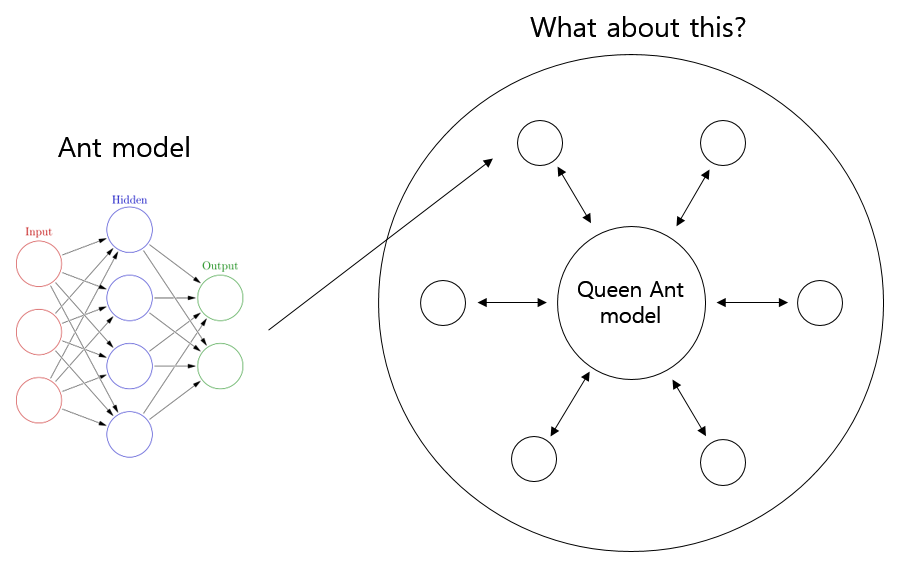

# Deep-ANT-Model

Every ant model has two outputs. One of them updates itself, and the other updates the queen ant model. 
s
The queen ant model updates all of the ant models by the same value as the sum of the outputs of all the ant models. 

The queen ant model tries to maximize the total benefit of the ant kingdom. 

The ant model does not have to be complicated, but has to do different things. 

I expect each person to do slightly different things in the process of updating themselves. 

The influence of the queen ants on the ants will prevent the ants from becoming too different.

## What is this meaning?

This model learn like real ant kingdom in the nature.

Modern artificial intelligence technology is not enough to make strong artificial intelligence. 

However, I do not learn only as a model, but I think that if several models learn and combine their strength, they will be a little closer to strong artificial intelligence.

Each ant is stupid, but the ants are smart. We call it Collective intelligence.

## So.. Where we can use the ant model?

I think we can use this model when we simulating something.
